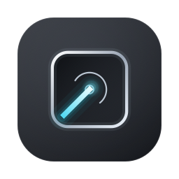

# LidKeep

**Turn the display off without stopping the Mac.**

The screen goes pitch black; the machine keeps working. Remote desktop stays connected, downloads keep going, builds keep running. Press a hotkey (or run one command over SSH) and the picture comes straight back.

[](../../releases/latest)
[](#requirements)
[](LICENSE)

Chinese: [README.zh-CN.md](README.zh-CN.md)

```
$ lidkeep off      # screen goes black, system keeps running
$ lidkeep on       # display restored (also works over SSH)
```

## Sound familiar?

| # | Situation | What usually happens |
|---|---|---|
| 1 | You want the screen dark to save power, but you're not at the machine | The moment it sleeps, remote desktop connects to a black frame |
| 2 | You close the lid and toss the Mac in a bag | The machine sleeps with it — downloads, builds and remote sessions all drop |
| 3 | You run closed-lid, or carry it closed | The moment sleep is prevented, the built-in panel stays lit — macOS never turns the backlight off just because you closed the lid |
| 4 | You brute-force it with `caffeinate` | The screen glows all night — power drain, burn-in risk, and everything on it is visible to passers-by |
| 5 | You use macOS display sleep | The framebuffer is torn down, screen sharing captures nothing, remote access is effectively dead |

**The core problem:** macOS wires "display off" and "system asleep" together. You only want the screen off; the system puts the whole machine to sleep.

## Why not just use the built-in options

| Method | Screen off | Remote frames | Machine keeps working | Works closed-lid | Permissions |
|---|:---:|:---:|:---:|:---:|---|
| macOS display sleep | ✅ | ❌ lost | ❌ sleeps | — | none |
| `pmset displaysleepnow` | ✅ | ❌ lost | ❌ sleeps | — | none |
| Screensaver / lock screen | ❌ still lit | ✅ | ⚠️ sleeps eventually | — | none |
| `caffeinate` | ❌ stays lit | ✅ | ✅ | ❌ AC power only | none |
| Third-party keep-awake apps | ❌ stays lit | ✅ | ✅ | partial | some need grants |
| **LidKeep** | ✅ | ✅ | ✅ | ✅ | **hotkey needs none** (lid mode needs a one-time helper) |

One row makes all the difference: **LidKeep kills the backlight, not the display's power.**
The display never sleeps, so the framebuffer keeps rendering and a remote viewer always sees the real picture instead of a black box.

## The fix: three switches, one job each

| Menu item | What it solves | How to use it |
|---|---|---|
| **Turn Display Off** | Screen goes black instantly, machine keeps running | Click it, or press ⌃⌥⌘B |
| **Power mode ▸** | Everything else | Pick one of the four below; it persists across restarts |

**Power mode** is exclusive — choosing one switches the others off, so you never have to work out which boxes can be ticked together. Each option states its own cost:

| Mode | What happens | Cost |
|---|---|---|
| **Off** | Display and Mac both sleep normally | none |
| **Stay awake, display may sleep** | Display sleeps as usual, the Mac keeps running | easy on battery |
| **Keep display on** | Display never sleeps on its own | uses more power |
| **Run with lid closed** | Keeps running with the lid shut, built-in panel off, for hours | needs the privileged helper; plug in if you can |

The lid mode runs on its own daemon, so it survives an app restart; the two display modes are held by the app itself.

## Up and running in 30 seconds

1. Download `LidKeep-<version>.dmg` from [Releases](../../releases/latest)
2. Open it and drag the app into Applications
3. Click the ☀ icon in the menu bar → **Turn Display Off**

The screen goes black. Press ⌃⌥⌘B (or click the icon again) to bring it back.
For closed-lid use, tick **Stay Awake with Lid Closed (long-running)** — one admin-password prompt installs a privileged helper, and it keeps working from then on.

## Three ways people actually use it

**A. The Mac as a remote host** (UURemote / ToDesk / VNC / SSH)
`lidkeep off` → screen dark, machine awake, remote picture fine. Press the hotkey when you're back at the desk.
Worried you'll forget? A 12-hour fallback timeout restores the display automatically.

**B. Closed in a bag, still working**
Tick "Stay Awake with Lid Closed" → close the lid → **the built-in panel turns itself off** (since v1.5.2, via the SMC lid switch). Downloads, builds and remote sessions keep going; open the lid and brightness is restored.
If the battery drops below the floor while discharging, it stops and notifies you instead of draining to zero.

**C. Stepping away from the desk**
Hit the hotkey; the screen goes dark and your tasks keep running.
⚠️ Blanking is **not** locking — anyone who sits down can still type. Press ⌃⌘Q before you leave.

## How it works

Instead of letting macOS put the display to sleep (which kills the framebuffer and breaks screen capture), LidKeep sets the **system brightness to 0** and holds a `caffeinate -di` assertion so the display pipeline stays fully powered. Verified behavior:

| Probe | Normal | Blacked out |
|---|---|---|
| Screenshot content | rendered | fully rendered (not painted black) |
| `CGDisplayIsAsleep()` | 0 | **0** — display never sleeps |
| Display power state | 4 (max) | **4** (max) |

The trade-off is deliberate: true display sleep saves ~0.5–1.5 W more, but makes remote frames unavailable. LidKeep keeps the machine fully remote-controllable.

## Details worth knowing

- **Zero permission grants.** The global hotkey uses the Carbon `RegisterEventHotKey` API, dispatched by WindowServer itself — no Accessibility or Input Monitoring grants, and it keeps working after every rebuild (ad-hoc signed binaries lose TCC grants on each recompile, the most common trap for small tools like this).
- **Crash-safe.** If the app is killed while the screen is black, the next launch restores your previous brightness automatically. A configurable fallback timeout (default 12 h) is the last safety net.
- **Battery guard.** Only on battery and discharging: below the floor (default 20%) a blackout is refused, and during a blackout the level is re-checked every 30 s — cross the floor and the display comes back with a notification. No effect on AC power.
- **CLI and app share state.** `lidkeep on` over SSH can restore a screen the menu bar app turned off, and vice versa.
- **Single instance.** Launching a second copy takes over cleanly and kills orphaned `caffeinate` helpers.
- **Update & about from the menu.** "View on GitHub" opens the repo in one click; "About LidKeep" shows the version, commit and license; "Check for Updates…" queries the GitHub Releases API and links to the download page when a newer version exists (with a manual fallback if the network is unavailable).
- **Automatic update checks** (on by default, switchable in Settings). The app quietly reads the latest version number once every 24 hours and only records the timestamp on success — a failed check is retried on the next heartbeat instead of leaving you unchecked for a whole day. A newer release raises a `⬆` badge in the menu bar and puts an "open the release page" entry at the top of the menu; nothing interrupts you, and the reminder stays until you actually install the new version. The request only reads a public version number and uploads nothing about your Mac.

## Language

**Follows your system**: Chinese system language → Chinese UI; anything else (including English) → English UI. The menu bar app and the CLI agree, with nothing to configure.

To switch it temporarily or permanently:

| Method | Usage |
|---|---|
| Environment variable | `LIDKEEP_LANG=zh lidkeep doctor` (`zh` / `en`) |
| Config file | set `"lang": "zh"` in `~/Library/Application Support/LidKeep/config.json` |

The config accepts `auto` (follow the system, default) / `zh` / `en`; the environment variable wins over it.

## Requirements

- macOS 13 Ventura or later (built as a universal binary: Apple Silicon + Intel)
- Built-in display (brightness control via DisplayServices; external monitors without DDC support are not affected)

## Install

**Option A — installer (recommended).** Download `LidKeep-<version>.pkg` from
[Releases](../../releases/latest) and double-click it. One step, both pieces installed:

| Installed to | Item |
|---|---|
| `/Applications/LidKeep.app` | menu bar app |
| `/usr/local/bin/lidkeep` | CLI |

The installer also clears the Gatekeeper quarantine flag and launches the app for you,
so there is nothing to do by hand.

**Option A2 — DMG drag-and-drop.** Download `LidKeep-<version>.dmg` from
[Releases](../../releases/latest), open it, and drag the app into Applications.
Double-click `Install Command-Line Tool.command` inside the image to also install the CLI
(one GUI password prompt). If Gatekeeper blocks the first launch, right-click
the app → **Open**.

**Option B — build from source** (needs Xcode Command Line Tools):

```bash
git clone https://github.com/Mihooni/lidkeep.git
cd lidkeep
./install.sh              # installs CLI to your Homebrew prefix (/opt/homebrew/bin on Apple Silicon, /usr/local/bin on Intel) + app to /Applications
```

`./install.sh --cli-only` skips the menu bar app. `make pkg` builds the same installer locally.

**Option C — download a prebuilt zip** from [Releases](../../releases/latest), then:

```bash
xattr -dr com.apple.quarantine LidKeep.app   # unsigned build: clear Gatekeeper flag
cp -R LidKeep.app /Applications/
# Apple Silicon: sudo cp lidkeep /opt/homebrew/bin/   |   Intel: sudo cp lidkeep /usr/local/bin/
```

> **Not signed with a paid developer certificate.** macOS may refuse to open the
> downloaded `.pkg` ("unidentified developer"). If that happens, right-click the
> `.pkg` → **Open**, then confirm. Same for the app on first launch — though the
> installer already clears its quarantine flag, so the app should open normally
> right after installing.

### Upgrading from an older release

The product has been called **LidKeep** since v2.0.0, when the CLI name, the app name and every
bundle identifier changed. State left behind by v1.x — its config folder, login item, privileged
helper and anti-sleep ledger — is **not** migrated or cleaned up automatically any more: back up
`~/Library/Application Support/` and remove the old app yourself before upgrading.

### Verify a download (optional)

Each release ships a `SHA256SUMS` checksum file plus GitHub build-provenance
attestations (SLSA), so you can confirm the artifacts came from this repo's
workflow — no Apple account needed:

```bash
shasum -a 256 -c SHA256SUMS                                          # bytes match what was published
gh attestation verify lidkeep-macos.zip -R Mihooni/lidkeep   # built by this repo's release workflow
```

## Usage

**Menu bar app** — click ☀ / 🌙 in the menu bar; the three core functions are named in plain words:

- **Turn Display Off** — black out now, machine keeps running (click again or press the hotkey to restore)
- **Power mode ▸** — four exclusive choices: Off / Stay awake, display may sleep / Keep display on / Run with lid closed
- **Install Privileged Helper…** (first run) — extends lid-closed mode to battery and closed lid (one password prompt)
- **Settings…** — hotkey combo + key, fallback timeout, battery guard, restore-brightness policy, launch at login
- **Hotkey Self-test** — synthesizes your hotkey once and verifies the delivery path (no side effects)
- **Open Log**

**CLI**:

```bash
lidkeep off                    # black out now (one-shot daemon, auto-restores after timeout)
lidkeep off --timeout 3600     # custom fallback timeout
lidkeep on                     # restore the display
lidkeep toggle                 # one-command switch — handy for hotkey tools and remote scripts
lidkeep status                 # state, including power source and battery level
lidkeep doctor                 # full self-check: display control, processes, leftovers
lidkeep version                # print version (include it when reporting issues)
lidkeep bright 0.5             # read/write system brightness directly
lidkeep service install        # run the CLI as a launchd service (menu app not required)
lidkeep config --key 11 --mods ctrl,alt,cmd --timeout 43200
lidkeep config --battery 20    # battery floor %: refuse/exit blackout below it (0 = off)
lidkeep config --auto-nosleep  # link anti-sleep to blackout; auto-reset on restore
```

Default hotkey: **⌃⌥⌘B**. Change it in the settings panel or via `lidkeep config`. The combo must include at least one modifier (⌘/⌃/⌥/⇧) — macOS rejects global hotkeys without one.

**Multiple displays:** blackout applies to every online display. However, most HDMI/DVI/DP
external monitors don't support software brightness, so those panels can't be dimmed —
`lidkeep doctor` tells you exactly which one, instead of leaving you guessing.

## Anti-sleep (closed lid / battery / headless)

Blackout only kills the backlight — the system itself still sleeps on schedule. If the machine must keep working while blacked out (remote access, downloads, closed-clamshell use), enable anti-sleep:

```bash
lidkeep nosleep setup                  # one command: install helper + blackout linkage + start anti-sleep
lidkeep nosleep on                     # process-level (caffeinate; effective on AC power only)
lidkeep nosleep on --system            # system-level (covers battery + lid; requires the helper)
lidkeep nosleep on --timeout 3600      # auto-stop after a duration
lidkeep nosleep status                 # level / power source / uptime
lidkeep nosleep off                    # stop and reset
```

### Lid-closed anti-sleep (long-running mode)

In the menu bar app, click **"Stay Awake with Lid Closed (long-running)"** to enable with one click — no terminal needed:

- **Closed lid = display off, machine keeps running**: downloads, remote access, external displays and long tasks all keep working
- **Automatic lid blackout (since v1.5.2)**: the daemon polls the SMC lid switch (MSLD key); on lid close it zeroes the built-in display brightness and restores it when the lid opens — the built-in panel only, external displays are never touched; when the daemon stops (battery floor / timeout / manual off) the brightness is restored too, never leaving a black screen behind
- **Persistent**: the flag is saved in config; the daemon is restored automatically after app or system restarts
- **Safety net**: auto-stops with a notification when the battery (discharging) drops below the floor (default 20%); turning it off resets `disablesleep`
- **Independent of blackout linkage**: the lid daemon and blackout-linked anti-sleep are separate entries in the owner ledger, so toggling one never disturbs the other
- Requires the privileged helper; if missing, the menu walks you through the graphical one-click install (one admin-password prompt)

You can also tick "Stay awake with lid closed (long-running mode)" in the settings panel, or use the CLI:

```bash
lidkeep nosleep on --system            # enable directly (helper required)
lidkeep nosleep status                 # shows the lid-mode state
lidkeep nosleep off                    # stop and reset
```

**Why does the system level need a privileged helper?** Per `man caffeinate`, the `-s` assertion is effective **on AC power only**. Covering battery and closed-lid requires `pmset disablesleep`, which must run as root. Install the helper once (asks for your admin password):

```bash
sudo lidkeep nosleep install-helper    # least privilege: sudoers limited to this tool, 4 whitelisted args
lidkeep nosleep detect                 # check disablesleep support on this system
sudo lidkeep nosleep uninstall-helper  # uninstall (resets disablesleep before removal)
```

Safety design:

- The helper is a whitelisted script that only accepts `on` / `off` / `status` / `detect` — it cannot be abused to run arbitrary commands
- sudoers grants a single user, running as root, exactly those four arguments
- Uninstall resets `disablesleep 0` *before* deleting the helper — no "system never sleeps again" leftovers
- A boot-time LaunchDaemon plus a self-heal check on every start reset any state left by a crashed process
- **Owner accounting:** `disablesleep` is a single global switch that "blackout-linked anti-sleep"
  and "manual anti-sleep" may both depend on. The helper records each owner, so when one stops it
  only unregisters itself — it never disables the anti-sleep the other one still relies on.
  (Ledger lives in `/var/db/lidkeep-nosleep`, owned by root; unprivileged users can't forge owners.)
- **Coexists with remote-control apps:** ToDesk / Sunlogin / UURemote / TeamViewer and friends hold the same switch to stay reachable. When one is running, `doctor` reports "held by a remote-control app" instead of flagging it as a leftover to fix.
- The battery floor applies to anti-sleep too — closed lid + battery + no sleep is the fastest way to drain a battery

## Uninstall

```bash
./uninstall.sh           # or: make uninstall
# config/logs (optional): rm -rf ~/Library/Application\ Support/LidKeep
```

## FAQ

**Hotkey doesn't trigger.** Check the ⚠ badge next to the menu bar icon. Three usual causes: the combo is taken by another app (pick another), the combo has no modifier, or the app was just reinstalled (quit and relaunch once). The hotkey itself never needs any permission.

**Does an auto-brightness sensor fight the blackout?** The app re-asserts brightness 0 twice a second, so ambient-light changes won't light the screen up.

**Why not just `pmset displaysleepnow`?** True display sleep tears down the framebuffer — remote viewers get nothing. Many apps (browsers, Electron apps) also hold `NoDisplaySleepAssertion`, which blocks display sleep entirely. Brightness-zeroing works everywhere and is the only method that keeps remote frames flowing.

**Power savings?** Backlight off saves roughly 1–2 W (up to ~15–30% of a lightly loaded machine). The GPU/compositor keep running by design.

**How does the battery guard work?** It only acts when the Mac is on battery and discharging: below the floor (default 20%), starting a blackout is refused; during a blackout the battery is re-checked every 30 s and the display is restored automatically with a notification once the floor is crossed. On AC power it never interferes. Set `lidkeep config --battery 0` (or the settings panel) to disable.

## Development

```bash
make            # build CLI + app into build/
make test       # end-to-end smoke test (arg validation, config round-trip, anti-sleep, asset parity)
make dev-tools  # build debugging helpers into build/dev-tools/
make clean
```

Source layout (Swift requires the top-level file to be named `main.swift`, so each target gets its own directory):

- `Sources/CLI/main.swift` — command-line tool
- `Sources/Bar/main.swift` — menu bar app
- `Sources/Shared/Version.swift` — generated at build time
- `dev-tools/` — helpers plus `smoke.sh`

`make test` skips cases the current environment can't run (e.g. it won't do a real blackout while
the menu bar app is live, since that would interrupt your session). Set `SMOKE_FULL=1` to force it.

## Known limitations

- **Some external displays can't be turned off.** Dimming relies on the software brightness API,
  which most HDMI/DVI/DP monitors don't support, so those panels stay lit during a blackout.
  `lidkeep doctor` names the exact display. Powering them down would require true display
  sleep, which breaks remote frames — this tool deliberately doesn't do that.

- The panel is **not powered down** — this is intentional. Backlight is driven to 0, so
  the framebuffer keeps rendering and screen-sharing / remote-desktop sessions keep
  working. True display sleep would break remote access; see [How it works](#how-it-works).

- **Blackout is not a lock screen.** While blacked out, anyone with physical access to the
  keyboard can still operate the machine — they just can't see it. Lock manually (⌃⌘Q).

## License

[MIT](LICENSE)
